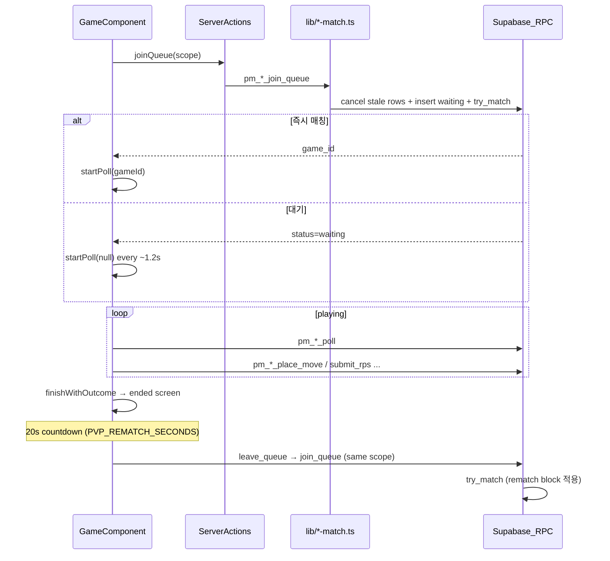

# 1:1 PvP 매칭 · 자동 재매칭 가이드

> **새 대전 게임**을 만들 때 이 문서를 따른다.  
> 관련: [`content-system.md`](content-system.md) §5.4 (제품 규칙), [`supabase-pm-conventions.md`](supabase-pm-conventions.md) (DB 네이밍)  
> 기준 구현: 순서쌍 오목 · 사각형 만들기 · 정사각형 만들기

---

## 1. 한 줄 요약

1:1 대전은 **영구 방(room)이 없다**. `대기열 행(queue)` + `게임 행(game)` + **RPC 폴링**으로 동기화한다.  
게임이 끝나면 **이전 매칭을 정리**하고 **같은 스코프**(같은 반 / 전체)로 **자동 재매칭**한다. 직전 상대와는 **20초간** 다시 매칭되지 않는다.

---

## 2. 언제 이 패턴을 쓰는가

| 패턴 | 예시 | 이 문서 |
|------|------|---------|
| **1:1 대기열 PvP** | 오목, 사각형/정사각형 만들기 | ✅ 이 문서 |
| 교사 세션 + 학생 참가 | 주사위 합 10, 상자 속 공 | ❌ 별도 (`pm_*_sessions` 모델) |
| 싱글 / AI만 | 각종 연습 게임 | ❌ 매칭 불필요 |

---

## 3. 아키텍처



### 핵심 원칙

1. **클라이언트는 테이블을 직접 읽지 않는다.** 모든 매칭·동기화는 `SECURITY DEFINER` RPC만 사용.
2. **Realtime 구독을 쓰지 않는다.** `pm_*_poll`을 약 **1.2초** 간격으로 호출.
3. **플레이어당 `waiting` 행은 최대 1개** (partial unique index).
4. 게임 종료 후 `matched` 큐 행이 **ended game에 붙어 있으면 안 된다** — 반드시 정리·재입장.

---

## 4. DB 객체 (게임별 `pm_<slug>_*`)

게임마다 **독립** 접두사를 쓴다. 예: 오목 `pm_omok_*`, 정사각형 `pm_sq_*`.

| 객체 | 역할 |
|------|------|
| `pm_<slug>_queue` | 대기열 (`status`: `waiting` \| `matched` \| `cancelled`) |
| `pm_<slug>_games` | 진행 중·종료된 판 (`status`: `playing` \| `black_win` \| `white_win` \| `draw`) |
| `pm_<slug>_ratings` | (선택) 게임별 누적 점수 |
| `pm_pvp_rematch_block` | **공유** — 직전 상대 20초 재매칭 방지 (`game_key` = `omok` \| `quad` \| `sq` 등) |

### 필수 RPC

| RPC | 역할 |
|-----|------|
| `pm_<slug>_resolve_identity` | 세션 토큰·게스트 ID → `player_key`, `class_id` |
| `pm_<slug>_join_queue(scope)` | stale 행 정리 → `waiting` 삽입 → `try_match` |
| `pm_<slug>_try_match(queue_id)` | 같은 스코프 상대 페어링 (내부) |
| `pm_<slug>_leave_queue` | `waiting` **및** `matched` 행 `cancelled` |
| `pm_<slug>_poll(game_id?)` | heartbeat, 매칭 재시도, 게임 상태 반환 |
| `pm_<slug>_expand_queue_global` | 반 대기 → 전체 대기로 확대 |
| 게임 로직 RPC | `place_move`, `submit_rps`, `timeout_move`, `claim_result` 등 |

### `join_queue` / `leave_queue` 규칙 (필수)

[`20260722102801_pm_pvp_post_game_requeue.sql`](../supabase/migrations/20260722102801_pm_pvp_post_game_requeue.sql) 이후 표준:

```sql
-- join_queue: 재입장 전 이전 행 전부 취소
UPDATE pm_<slug>_queue
SET status = 'cancelled', updated_at = now()
WHERE player_key = v_key AND status IN ('waiting', 'matched');

-- leave_queue: 로비 복귀·대기 취소 시
WHERE player_key = v_key AND status IN ('waiting', 'matched');
```

### `poll` — stale `matched` 방지 (필수)

`matched` 행이 가리키는 게임이 `playing`이 아니면, 해당 큐 행을 `cancelled`하고 **ended game을 반환하지 않는다**.  
그렇지 않으면 클라이언트가 종료된 판에 계속 붙어 있는 것처럼 보인다.

```sql
ELSIF v_q.status = 'matched' AND v_q.game_id IS NOT NULL THEN
  SELECT g.status INTO v_linked_status FROM pm_<slug>_games g WHERE g.id = v_q.game_id;
  IF v_linked_status IS DISTINCT FROM 'playing' THEN
    UPDATE pm_<slug>_queue SET status = 'cancelled', updated_at = now() WHERE id = v_q.id;
    -- v_gid 초기화, v_has_queue := false
  END IF;
END IF;
```

### 매칭 스코프

| `scope` | 대상 |
|---------|------|
| `class` | `pm_students.class_id`가 같은 학생끼리 |
| `global` | 로그인 학생 + 게스트 (`guest:{uuid}`) |

- 대기 행 `updated_at`이 **15초** 이내여야 매칭 후보 (`poll`이 heartbeat).
- **2분** 이상 갱신 없으면 고스트로 `cancelled`.

### 직전 상대 20초 차단

- 게임 종료 트리거 → `pm_pvp_record_rematch_block(game_key, black_key, white_key, 20)`.
- `try_match`에서 `pm_pvp_rematch_block`에 걸린 상대는 스킵.
- 상수: DB `pm_pvp_rematch_seconds()` = 클라이언트 [`lib/pvp-constants.ts`](../lib/pvp-constants.ts) `PVP_REMATCH_SECONDS` (**반드시 동기**).

---

## 5. 앱 레이어 (파일 구조)

새 게임 `g{n}-u{m}-{slug}` 추가 시 **아래 4층을 모두** 만든다.

```
app/play/{contentKey}/
  page.tsx          # 플레이 페이지
  actions.ts        # "use server" — lib 래핑 + XP/랭킹

lib/
  {slug}-match.ts   # Supabase RPC 호출 (server-only)
  {slug}-types.ts   # PollState, QueueScope, TURN_SECONDS
  {slug}-rating.ts  # (선택) pm_*_apply_rating, 랭킹 조회
  pvp-constants.ts  # 공유 PVP_REMATCH_SECONDS

components/games/
  {GameName}.tsx    # 로비·대기·플레이·종료 UI + 폴링·재매칭

supabase/migrations/
  YYYYMMDD_pm_{slug}_matchmaking.sql
```

### 기존 게임 참조

| 게임 | contentKey | match lib | 컴포넌트 |
|------|------------|-----------|----------|
| 순서쌍 오목 | `g1-u2-3-ordered-pair-omok` | `lib/omok-match.ts` | `OrderedPairOmok.tsx` |
| 사각형 만들기 | `g2-u3-1-quadrilateral-maker` | `lib/quad-match.ts` | `QuadrilateralMaker.tsx` |
| 정사각형 만들기 | `g3-u1-square-maker` | `lib/sq-match.ts` | `SquareMaker.tsx` |

---

## 6. 클라이언트 화면 흐름

```
lobby
  ├─ 컴퓨터와 두기 → ai 모드 (재매칭 없음)
  └─ 같은 반 / 전체 대전 → startMatchmaking(scope)
        ├─ 즉시 매칭 → rps / playing
        └─ waiting (+ 전체 확대, 대기 취소)
playing / rps
  └─ poll ~1.2s, finishWithOutcome on ended
ended (mode === "pvp" 만)
  ├─ 20초 카운트다운 → triggerPvpRequeue()
  ├─ 「새 상대 찾기」→ 즉시 triggerPvpRequeue()
  ├─ 「로비로」→ clearRequeueTimer + leave_queue + lobby
  └─ 「컴퓨터와 다시」→ clearRequeueTimer + AI 시작
```

### `Screen` 타입 (권장)

```ts
type Screen = "lobby" | "waiting" | "rps" | "playing" | "ended";
// 사각형 계열: "shape_pick" 추가 가능
type Mode = "ai" | "pvp";
```

---

## 7. 종료 후 자동 재매칭 (표준 구현)

**모든 1:1 PvP 게임은 동일 패턴**을 따른다. 한 게임만 다르게 만들지 말 것.

### 7.1 `finishWithOutcome`

1. `endingRef.current = true` (중복 종료 방지)
2. `stopPoll()` — ended 판에 poll이 붙지 않게
3. 결과·랭킹 UI 표시 (`setScreen("ended")`)
4. **PvP일 때** 아래 §7.2 타이머가 자동 시작됨 (`mode === "pvp"`)

### 7.2 재매칭 타이머 (`useEffect`)

```ts
import { PVP_REMATCH_SECONDS } from "@/lib/pvp-constants";

// screen === "ended" && mode === "pvp" 일 때만
// requeueSecondsLeft: PVP_REMATCH_SECONDS → 0 카운트다운
// 0이 되면 triggerPvpRequeue()
```

- interval cleanup: 화면 이탈·로비 복귀 시 반드시 `clearRequeueTimer()`.
- `queueScopeRef`에 마지막 매칭 스코프(`class` \| `global`) 보관 → 재입장 시 동일 스코프 사용.

### 7.3 `triggerPvpRequeue`

```ts
async function triggerPvpRequeue() {
  clearRequeueTimer();
  await leaveQueueAction({ guestId });   // matched 정리
  endingRef.current = false;
  // 상태 초기화 (board, outcome, gameId, snapshot ...)
  const joined = await joinQueueAction({ scope: queueScopeRef.current, guestId });
  // joined.gameId 있으면 startPoll(gameId), 없으면 waiting + startPoll(null)
}
```

`join_queue`가 stale `matched`를 취소하므로, **반드시 leave 후 join** 또는 join만 호출해도 되지만 leave를 먼저 호출하는 것이 의도가 명확하다.

### 7.4 `backToLobby` / `cancelWait`

둘 다 **`leave_queue` RPC 호출** + 재매칭 타이머 취소.  
로비로 나가면 대기열·이전 방에서 완전히 이탈한다.

### 7.5 ended 화면 UI (필수 요소)

| 요소 | 설명 |
|------|------|
| 카운트다운 | `{n}초 후 새 상대를 찾아요` |
| 안내 문구 | 직전 상대 20초 재매칭 방지 |
| 「새 상대 찾기」 | 카운트다운 스킵 |
| 「로비로」 | 재매칭 취소 |
| 「컴퓨터와 다시」 | 재매칭 취소 후 AI |

### 7.6 waiting 화면 UI

- `직전 상대와는 {PVP_REMATCH_SECONDS}초간 다시 매칭되지 않아요.` 안내 추가.

---

## 8. 폴링 규칙

```ts
const POLL_MS = 1200;

function startPoll(gameId?: string | null) {
  stopPoll();
  const tick = async () => {
    if (endingRef.current || placingRef.current) return;
    const state = await pollAction({ guestId, gameId: gameId ?? gameIdRef.current });
    applyPollPlaying(state);
    // turn timeout 처리 (해당 게임에 수당 제한이 있을 때)
  };
  void tick();
  pollRef.current = setInterval(() => void tick(), POLL_MS);
}
```

- `finishWithOutcome`에서 **반드시** `stopPoll()`.
- `applyPollState`에서 `phase === "ended"` → `finishWithOutcome` (한 번만).
- `endingRef`로 ended 이후 poll 응답 무시.

---

## 9. 신원 (identity)

| 사용자 | `player_key` | 반 매칭 |
|--------|--------------|---------|
| 학생 (세션) | `student:{pm_students.id}` | `pm_students.class_id` 사용 |
| 게스트 | `guest:{localStorage uuid}` | `class` 불가 → `global`만 |

- 게스트 ID: 컴포넌트 `localStorage` + `guestIdRef` (게임별 키, 예: `pm_sq_guest_id`).
- 서버: `getStudentSessionToken()` + `p_guest_id`를 RPC에 전달.

---

## 10. 새 1:1 PvP 게임 체크리스트

### DB (마이그레이션 — **적용 전 사람 확인**)

- [ ] `pm_<slug>_queue`, `pm_<slug>_games` (+ 필요 시 `pm_<slug>_ratings`)
- [ ] 모든 객체·RPC 이름 `pm_` 접두사
- [ ] `pm_<slug>_resolve_identity`, `join_queue`, `leave_queue`, `poll`, `try_match`, `expand_queue_global`
- [ ] `join_queue` / `leave_queue`: `status IN ('waiting', 'matched')` 취소
- [ ] `poll`: stale `matched` → ended game 미반환
- [ ] `pm_<slug>_games` 종료 트리거 → `pm_pvp_record_rematch_block('<game_key>', ...)`
- [ ] `try_match`에 rematch block `NOT EXISTS` 조건
- [ ] RLS enable, 정책 없음 (RPC만 접근)

### 서버 lib + actions

- [ ] `lib/{slug}-match.ts` — RPC 래퍼 (`server-only`)
- [ ] `lib/{slug}-types.ts` — `PollState`, `QueueScope`
- [ ] `app/play/{contentKey}/actions.ts` — join/leave/poll/move + `submitGameRun` / rating

### UI 컴포넌트

- [ ] `lobby` — 같은 반 / 전체 / 컴퓨터
- [ ] `waiting` — poll, 전체 확대, 대기 취소, 20초 안내
- [ ] `playing` (+ `rps` 등 게임별 단계)
- [ ] `ended` — **§7 자동 재매칭** 전부 구현
- [ ] `backToLobby` / `cancelWait` → `leave_queue`
- [ ] `PVP_REMATCH_SECONDS` import (`lib/pvp-constants.ts`)

### 카탈로그·문서

- [ ] [`lib/contents.ts`](../lib/contents.ts) 등록
- [ ] [`content-system.md`](content-system.md) §5.4 게임 표에 한 줄 추가
- [ ] 이 문서 §5 참조 표에 한 줄 추가

---

## 11. 흔한 실수

| 증상 | 원인 | 해결 |
|------|------|------|
| 종료 후 같은 판·같은 상대에 머무는 느낌 | `matched` 큐 행 + ended `game_id` 유지 | `leave_queue` / `join_queue` / `poll` stale 정리 |
| 재매칭이 아예 안 됨 | ended 화면에 재매칭 로직 없음 | §7 타이머 + `triggerPvpRequeue` |
| 로비로 나가도 다시 옛 게임 | `backToLobby`에 `leave_queue` 없음 | §7.4 |
| 직전 상대만 계속 매칭 | rematch block 미적용 | 트리거 + `try_match` 조건 확인 |
| 대기가 영원히 안 풀림 | poll heartbeat 누락 | `waiting` 시 `updated_at` 갱신 |
| 학급 매칭이 안 됨 | 게스트로 접속 | `class`는 학생 세션만 |

---

## 12. 변경 이력

| 날짜 | 내용 |
|------|------|
| 2026-07-21 | 직전 상대 20초 재매칭 방지 (`pm_pvp_rematch_block`) |
| 2026-07-22 | 종료 후 자동 재매칭 · stale `matched` 정리 · 본 가이드 초판 |
